# LED-MERKKI


## Mistä koostuu ja miten se toimii
Salaman mikrokontrolleri (mcu) ohjaa ledejä sytyttäen niitä yksi kerrallaan hyvin lyhyeksi aikaa.
Ledit ovat multiplexattu (4x8 LED), ja kytketty yhdellä vastuksella per rivi.

Levyyn on myös suunniteltu kytkin, jolla voisi vaikka sammuttaa laitteen tai toimittaa muuta toiminnallisuutta, mutta näitä ei ole koodissa toteutettu vieläkään.

Kuusipinninen liitin on ohjelmointia varten ja sitä kautta ohjelma siirretääm mikrokontrollerille.
Ohjelmointi hoituu Arduinon ISP:n kautta.

## Skeema
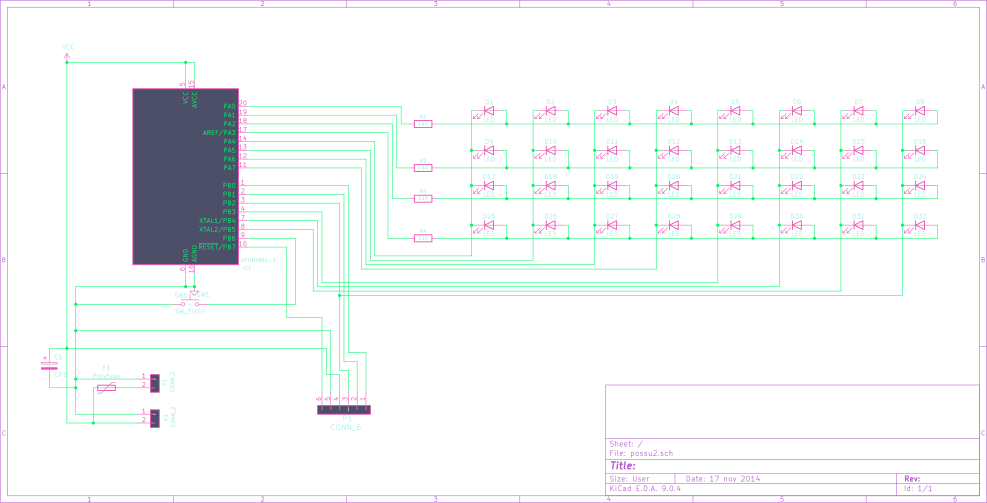

## Osaluettelo
<!--
  * 1 kpl  ATtiny861a SOIC
  * 32 kpl 3 mm diffusoitu LED
  * 1 kpl  10 µF SMD tantaalikondensaattori
  * Kuusi pinnisen piikkiriman ohjelmointia varten.

  **Riippuen LEDien väristä:**
  * Siniset/valkoiset/vihreät:   4 kpl 110 Ohm 1206/1210 SMD-vastus
  * Punaiset/keltaiset:          4 kpl 150 Ohm...
  
  **lisäksi tarvitset:**
  * kuumaliimaa
  * USB kaapelin
  * Extra vastuksen? Selivä myöhemmin...
  * haalarimerkin :-)
-->

| **Komponetti** | **KPL** | **Huomautukset** |
| :--- | :--- | :--- |
| ATtiny861a SOIC | 1 | S/SU |
| 3 mm diffusoitu LED | 32 | |
| 110 Ohm 1206/1210 SMD vastus | 4 | Sinisille, valkoisille, vihreille ledeille |
| 150 Ohm 1206/1210 SMD vastus | 4 | Keltaisille, punaisille ledeille |
| 10 µF SMD tantaalikondensaattori | 1 | |
| 6 pinnisen piikkirima | - | Ohjelmointia varten |
| Kuumaliimaa | - | Ledien suojaamiseen |
| USB kaapeli | - | Sopivan pituinen, vaikka 1 m |
| Haalarimerki | 1 | :-) |

<!---
| **Komponetti** | **KPL** | **Huomautukset** |
| :--- | :--- | :--- |
| ATtiny861a SOIC | 1 | S/SU |
| 3 mm diffusoitu LED | 32 | |
| 10 µF SMD tantaalikondensaattori | 1 | |

| **Vastuksets** | **KPL** | **Huomautukset** |
 :--- | :--- | :--- |
| 110 Ohm 1206/1210 SMD vastus | 4 | Sinisille, valkoisille, vihreille ledeille |
| 150 Ohm 1206/1210 SMD vastus | 4 | Keltaisille, punaisille ledeille |
| | | | 

| **Lisäksi tarvitset** | |
 :--- | :--- |
| 6 pinnisen piikkirima | ohjelmointia varten |
| Kuumaliimaa | Ledien suojaamiseen |
| USB kaapelin | Sopivan pituinen |
| Haalarimerkin  | :-) |
--->
  
## Pirilevyt 
| [SIK](kicad/possu) | OTiT | [YRK](kicad/ymp) | [PROSE](kicad/prose) | [KONE](kicad/kone) | [ARK](kicad/ark) | [OPTIEM](kicad/optiem) |
| :---: | :---: | :---: | :---: |  :---: |  :---: |  :---: |
|  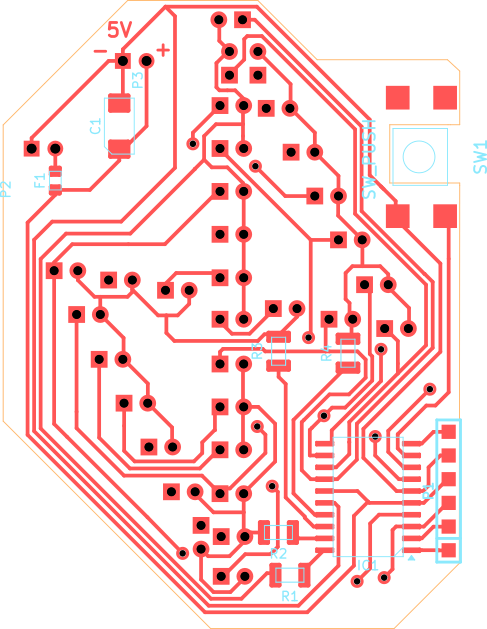 | 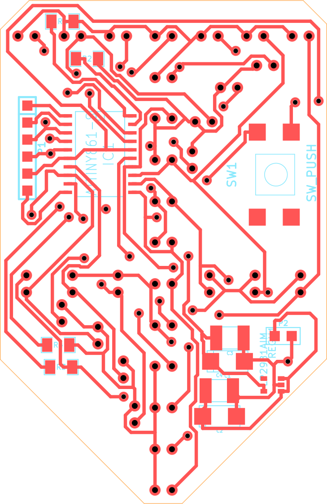  | 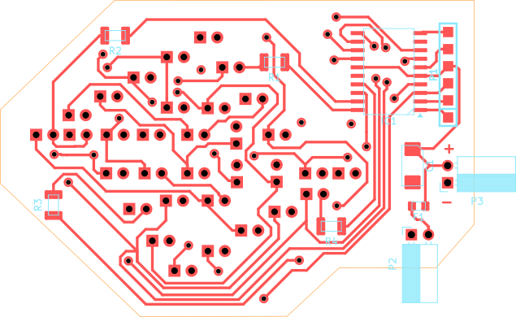  | 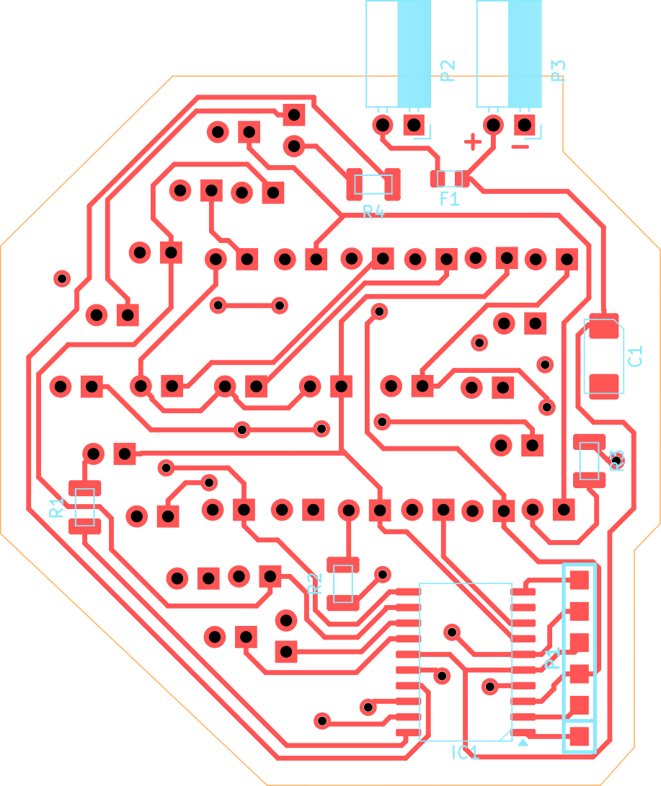 | 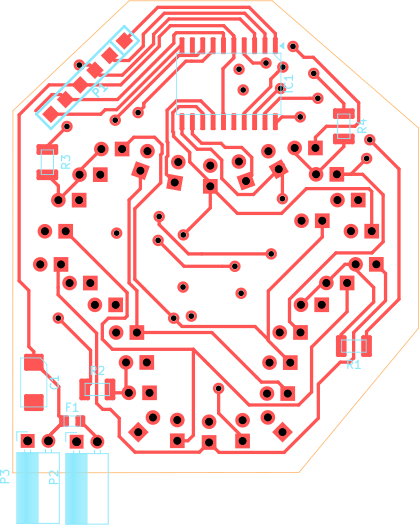 | 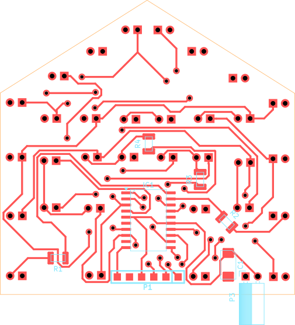 | 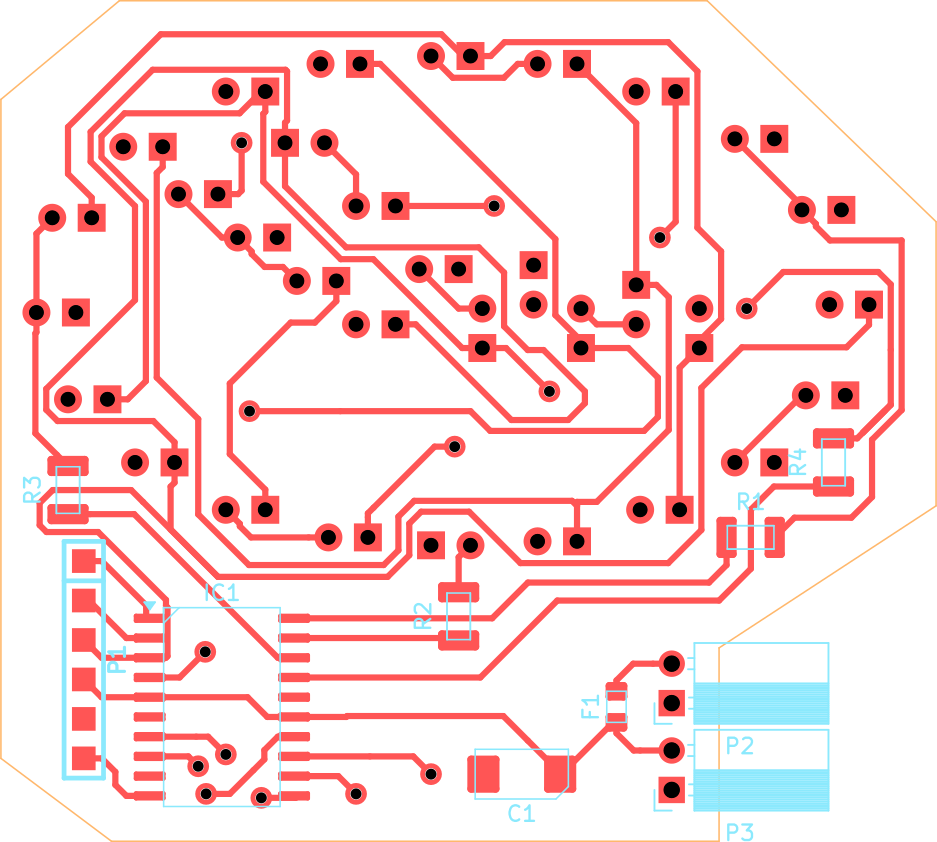 <tr></tr>
| 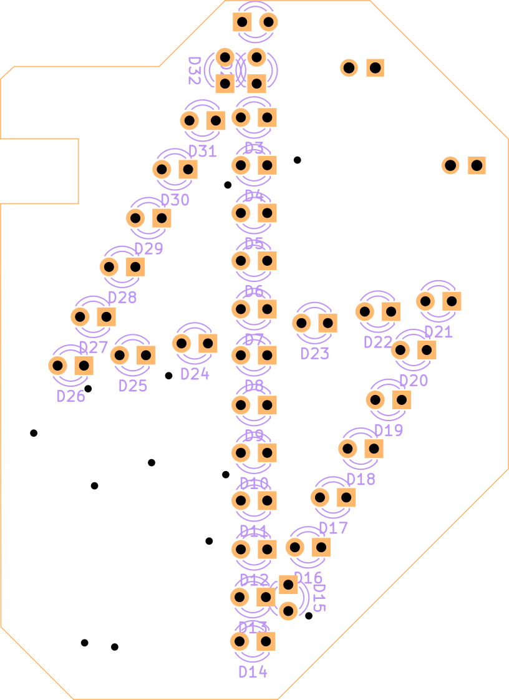 | 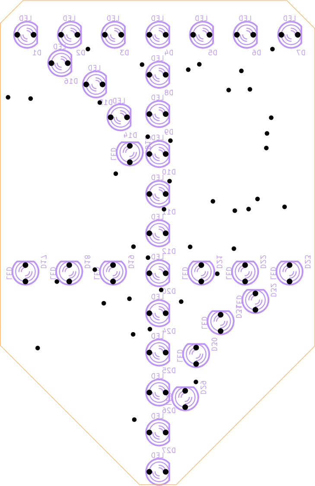 | 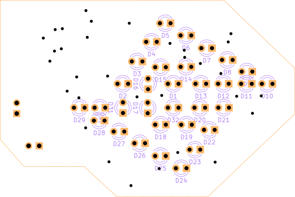 | 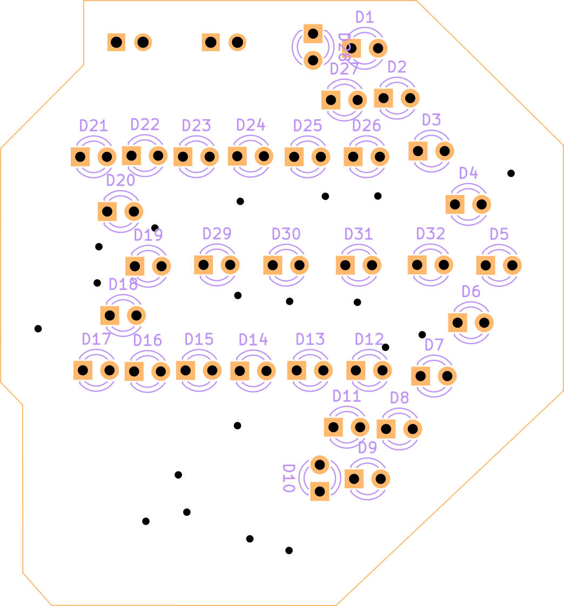 | 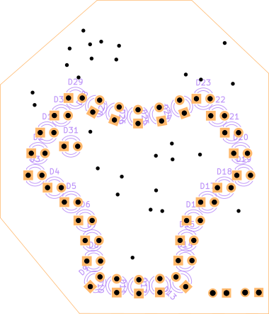 |  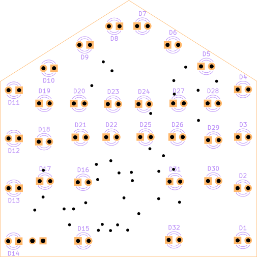 | 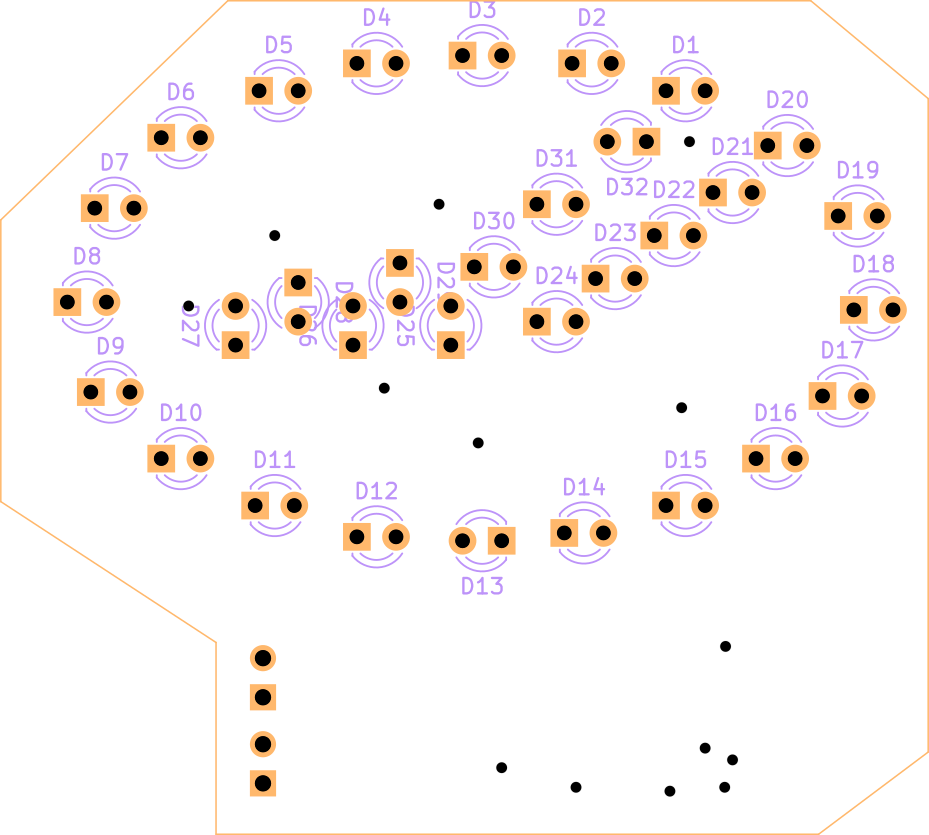
<!---| 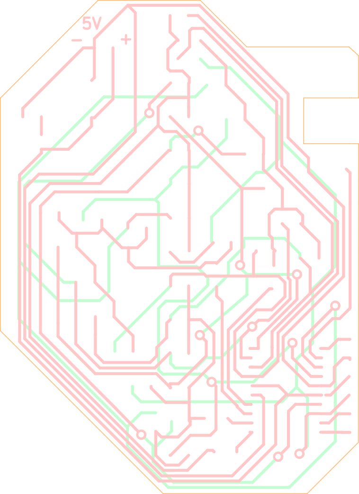  |   |   |   | | | <tr></tr> --->


## Ohjeet piirilevyn tekoon
<details>
<summary><b>Näytä </b></summary>
Tee vaikka syövyttämällä tai jyrsimällä :D
</details>

## Ohjeet kokoonpanoon
<!--<details>
<summary><b>Näytä</b></summary>
-->

**Nyt kun sinulla on piirilevy, laitetaampa siihen komponentit kiinni.**

1. Piirilevyyn juotetaan 4 SMD vastusta ja 1 SMD kondensaattori.
   Helpointen ja nätein tapa juottaa ne on laittamalla yhteen pädiin vähän tinaa ja sitten varovasti työntämällä komponetti sulaa tinaa, niin ettei se jää "ilmaan".
   Toinen puoli on helpompi juottaa kun se nyt pysyy siinä paikallaan.

   Vastuksilla ei ole väliä kummin päin ne on laitettu, kuhan numero puoli on ylöspäin ja suhteellisen suoraan laitettu, se on hyvä.
   Kondensaattorin suunta pitää kattoa piirikaaviosta.
   #
 
2. Piirin juottaminen onnistuu helpointen siten, että juotat ensin yhden kulman kiinni. Sulata juotos, jos piiri on vinossa.
   Tarkista, että piirin kaikki jalat ovat pädien päällä. Ei ilmassa.
   Juota sitten toinen vastakkainen kulma.

   Loput jalat voi juottaa yksi kerrallaan.
   Tai jos haluaa kokeilla nopeammalla tavalla niin veto juottamalla saa yhden puolen yhdehllä vedolla*. [Esimerkki video...](https://www.youtube.com/results?search_query=drag+soldering)
   #
3. 6-pinninen piikkirima on ohjelmointia varten, juottaminen onnistuu samalla tavalla kuin vastukset.
   #
4. USB kaapelista pitää leikata toinen pää pois.
Kuori 5v and GND johdot joko saksilla tai kuorimilla.
Juota sitten 5V ja GND piirilevyyn.

   Tähän kannattaa käyttää USB kaapelia jossa on vain 5V ja GND tai semmosta kaapelia jossa on paksut sisäiset johtimet.

   #
6. Ledien juottamisessa on suurin työmaa merkin valmistuksessa. Työtä aiheuttaa lähinnä ledin painaminen merkistä läpi. Ensin pitää huomioida polariteetti. Jos olet nähnyt paljon vaivaa että olet laittanut ledit miten sattuu niin voipi harmittaa..

   Pidä mielessä: + = pyöreä läpiveto, pidempi jalka ledissä. - = neliö läpiveto, lyhyempi jalka.

   Ledien jalkojen päät kannattaa katkoa kulmassa, näin niistä tulee teräviä. Helpottaa ledien painamista merkistä läpi.
   Toinen kikka on myös paksummalla neulalla tehä reikiä etukäteen.

   Jos jostakin syystä, olet juottanut kaikki ledin väärin päin. Erinomaista, nyt ledit ei toimi.
   Onneksi on olemassa koodin pätkä joka vaihtaa virran suunnan.
   #
8. Hyppää kohtaan "Ohjelmointi"
   #
9. Sitten kun ohjelmisto on flashatty ja tarkistettu, että kaikki ledit toimiii niinkuin pitäisi, piikkirima otetaan pois. Joko imusukkaa / tinapumppua käyttäen tai sitten lämmittämällä tinaa kolvilla, tekemällä veto liikkeitä.
    #
10. Tässä kohtaan on hyvä kokeilla laittaa merkki powerbankkiin kiinni. Jos merkki sammuu itsestään, se voi hyvinkin johtua siitä, että merkki on liian energiatehokas :D
    Esim. SIK:in possu merkki syöpi n. 5-20 ma riippuen ledien tilasta.

    Tämän ongelman saa korjattua juottamalla ylimääräisen vastuksen 5V ja GND väliin.
    Esim. Juottamalla 110 ohmin vastuksen, merkki syö ~60 ma.
    Vastuksen suuruus riippuu powerbankistä. Joissakin on joko suurempi tai pienempi minimi virta vaatimus. 
    #
12. Lopuksi, laita kuumaliimaa ledien ympärille suojausta varten.
   Ei ole pakko jos et halua.

</details>


## Ohjelmointi

<!--<details>
<summary><b>Näytä</b></summary> -->

1. Ensiksi Arduinoon pitää puskea ISP kooodit.

    ```
    File > Examples > 11.ArduinoISP
    ```
    Verifoi ja uploadaa sketch.
    <br/><br/>

  
2.  Merkin ohjelmointiliittimen pinnit keskeltä reunalle:

    ```
    Nro:  Nimi:   Arduinon pinni (nano):
    
    6:    Reset   10
    5:    GND     GND
    4:    VCC     VCC
    3:    SCK     13
    2:    MISO    12
    1:    MOSI    11
    
    Muista vetää arduinon Reset ylös. Ardu nollautuu kun sarjaliikenne alotetaan....
    ```

3. Src hakemistosta löytyy tiedostot lediportit_oikein.h ja lediportit_väärin.h joista jompikumpi ylikirjoitetaan lediportit.h tiedostoon jos ledit on juotettu väärin päin.

   Toinen vaihtoehto on käyttää valmiiksi compilattuja koodeja pre_compiled hakemistosta.
   Jolloin seuraavassa kohdassa käytetään a.out siijaan joka oikein.out tai vaarin.out.
    
4. Koodin kääntämiseen ja ohjelman levylle siirtämiseen komennot ovat:

   #####  Unix-like
   
   ```
   // kääntäminen
   avr-gcc -mmcu=attiny861 vilkutus.c salama.c -I./ -Os -DF_CPU=8000000UL  
   
   // Fläsäys käyttäen arduino-isp:tä
   avrdude -c avrisp -p t861 -B3 -P /dev/ttyUSB0 -b 19200 -U flash:w:a.out
   
   // Fuse asetukset käyttäen arduino-isp:tä
   avrdude -c avrisp -p t861 -B3 -P /dev/ttyUSB0 -b 19200 -U lfuse:w:0xe2:m -U hfuse:w:0xdf:m
   ```
   ##### Windows
   
   ```
   // kääntäminen
   avr-gcc -mmcu=attiny861 vilkutus.c salama.c -I./ -Os -DF_CPU=8000000UL
   
   // Fläsäys käyttäen arduino-isp:tä
   avrdude -C "C:\Program Files (x86)\Arduino\hardware\tools\avr\etc\avrdude.conf" -c avrisp -p t861 -B3 -P COM7 -b 19200 -U flash:w:a.out
   
   // Fuse asetukset käyttäen arduino-isp:tä
   avrdude -C "C:\Program Files (x86)\Arduino\hardware\tools\avr\etc\avrdude.conf" -c avrisp -p t861 -B3 -P COM7 -b 19200 -U lfuse:w:0xe2:m -U hfuse:w:0xdf:m
   ```
   Windowsilla avrdude pitää olla ympäristömuuttujissa. Toinen vaihtoehto on ajaa komento "\Arduino\hardware\tools\avr\bin"-kansiossa.

<!--</details> -->
