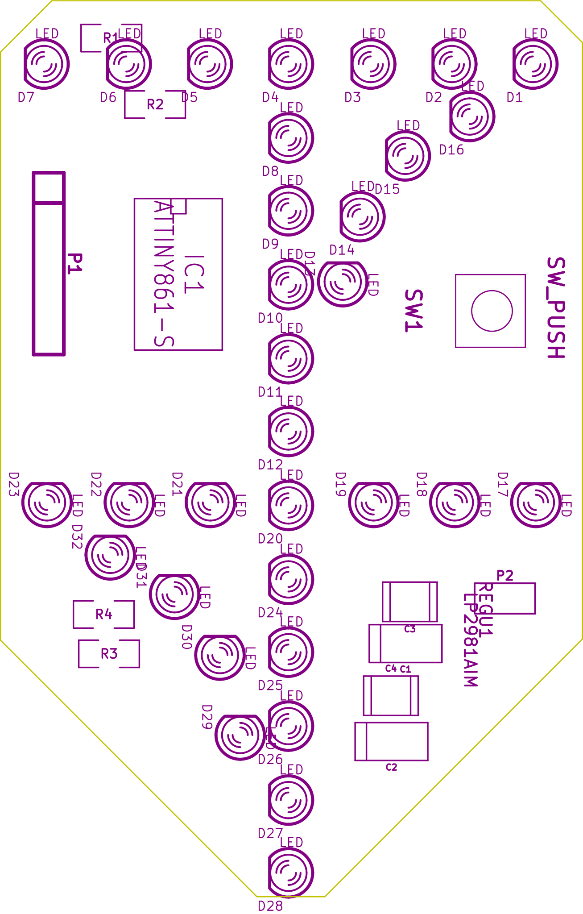

# LED-MERKKI


## Mistä koostuu ja miten se toimii
Salaman mikrokontrolleri (mcu) ohjaa ledejä sytyttäen niitä yksi kerrallaan hyvin lyhyeksi aikaa.

Ledejä on 32 (multiplexattu 4x8kpl), ja kytketty yhdellä vastuksella per rivi.

Levyyn on myös suunniteltu kytkin, jolla voisi vaikka sammuttaa laitteen tai toimittaa muuta toiminnallisuutta, mutta näitä ei ole koodissa toteutettu vielä.

Kuusipinninen liitin on ohjelmointia varten ja sitä kautta ohjelma siirretääm mikrokontrollerille.

## Skeema


## Osaluettelo
  * 1 kpl  ATtiny861a SOIC
  * 32 kpl sininen 3 mm diffusoitu led
  * 4 kpl  110 Ohm 1206 smd-vastus
  * 1 kpl  10 µF tantaalikondensaattori SMD
  * 1 kpl  palautuva kytkin (halutessa)
  
  **lisäksi tarvitset:**
  * kuusi pinnisen piikkiriman ohjelmointia varten.
  * kuumaliimaa
  * USB kaapelin
  * haalarimerkin :-)
  
## Pirilevyt 
| [SIK](kicad/possu) | OTiT | [YRK](kicad/ymp) | [PROSE](kicad/prose) | [KONE](kicad/kone) | [ARK](kicad/ark) | [OPTIEM](kicad/optiem) |
| :---: | :---: | :---: | :---: |  :---: |  :---: |  :---: |
|   |   | C  | D  | | |
|   | 2  | 3  | 4  | | |
|  |  | | | |

## Ohjeet piirilevyn tekoon
<details>
<summary><b>Näytä </b></summary>
Jotain hyvää konstaa
</details>

## Ohjeet kokoonpanoon
<details>
<summary><b>Näytä</b></summary>


Nyt kun sinulla on piirilevy, laitetaampa siihen komponentit kiinni.

1. Piirilevyyn juotetaan 4 SMD vastusta ja 1 SMD kondensaattori.
   Helpointen ja nätein tapa juottaa ne on laittamalla yhteen pädiin vähän tinaa ja sitten varovasti työntämällä komponetti sulaa tinaa, niin ettei se jää "ilmaan".
   Toinen puoli on helpompi juottaa kun se nyt pysyy siinä paikallaan.

   Vastuksilla ei ole väliä kummin päin ne on laitettu, kuhan numero puoli on ylöspäin ja suhteellisen suoraan laitettu, se on hyvä.
   Kondensaattorin suunta pitää kattoa piirikaaviosta.

2. Piirin juottaminen onnistuu helpointen siten, että juotat ensin yhden kulman kiinni. Sulata juotos, jos piiri on vinossa.
   Tarkista, että piirin kaikki jalat ovat pädien päällä. Ei ilmassa.
   Juota sitten toinen vastakkainen kulma.

   Loput jalat voi juottaa yksi kerrallaan.
   Tai jos haluaa kokeilla nopeammalla tavalla niin veto juottamalla saa yhden puolen yhdehllä vedolla*. [Esimerkki video...](https://www.youtube.com/results?search_query=drag+soldering)
   
3. 6-pinninen piikkirima on ohjelmointia varten, juottaminen onnistuu samalla tavalla kuin vastukset.

4. USB kaapelista pitää leikata toinen pää pois.
Kuori 5v and GND johdot joko saksilla tai kuorimilla.
Juota sitten 5V ja GND piirilevyyn.

   Tähän kannattaa käyttää USB kaapelia jossa on vain 5V ja GND tai semmosta kaapelia jossa on paksut sisäiset johtimet.


6. Ledit Ledien juottamisessa on suurin työmaa merkin valmistuksessa. Työtä aiheuttaa lähinnä ledin painaminen merkistä läpi. Ensin pitää huomioida polariteetti. Jos olet nähnyt paljon vaivaa että olet laittanut ledit miten sattuu niin voipi harmittaa..

7. Hyppää kohtaan "Ohjelmointi"

8. Sitten kun ohjelmisto on flashatty ja tarkistettu, että kaikki ledit toimiii niinkuin pitäisi, piikkirima otetaan pois. Joko imusukkaa / tinapumppua käyttäen tai sitten lämmittämällä tinaa kolvilla, tekemällä veto liikkeitä.

9. Lopuksi, laita kuumaliimaa ledien ympärille suojausta varten.
   Ei ole pakko jos et halua.

</details>


## Ohjelmointi

<details>
<summary><b>Näytä</b></summary>
Ohjelma siirtyy levylle kätevästi käyttäen arduinoa ohjelmointilaitteena.

```
Salaman ohjelmointiliittimen pinnit keskeltä reunalle:

Nro:  Nimi:   Arduinon pinni (nano):

6:    Reset   10
5:    GND     GND
4:    VCC     VCC
3:    SCK     13
2:    MISO    12
1:    MOSI    11

Muista vetää arduinon Reset ylös. Ardu nollautuu kun sarjaliikenne alotetaan....
```

Src hakemistosta löytyy tiedostot lediportit_oikein.h ja lediportit_väärin.h joista jompikumpi ylikirjoitetaan lediportit.h tiedostoon jos ledit on juotettu väärin päin.

Koodin kääntämiseen ja ohjelman levylle siirtämiseen komennot ovat:

#####  Unix-like

```
// kääntäminen
avr-gcc -mmcu=attiny861 vilkutus.c salama.c -I./ -Os -DF_CPU=8000000UL  

// Fläsäys käyttäen arduino-isp:tä
avrdude -c avrisp -p t861 -B3 -P /dev/ttyUSB0 -b 19200 -U flash:w:a.out

// Fuse asetukset käyttäen arduino-isp:tä
avrdude -c avrisp -p t861 -B3 -P /dev/ttyUSB0 -b 19200 -U lfuse:w:0xe2:m -U hfuse:w:0xdf:m
```
##### Windows

```
// kääntäminen
avr-gcc -mmcu=attiny861 vilkutus.c salama.c -I./ -Os -DF_CPU=8000000UL

// Fläsäys käyttäen arduino-isp:tä
avrdude -C "C:\Program Files (x86)\Arduino\hardware\tools\avr\etc\avrdude.conf" -c avrisp -p t861 -B3 -P COM7 -b 19200 -U flash:w:a.out

// Fuse asetukset käyttäen arduino-isp:tä
avrdude -C "C:\Program Files (x86)\Arduino\hardware\tools\avr\etc\avrdude.conf" -c avrisp -p t861 -B3 -P COM7 -b 19200 -U lfuse:w:0xe2:m -U hfuse:w:0xdf:m
```
Windowsilla avrdude pitää olla ympäristömuuttujissa. Toinen vaihtoehto on ajaa komento "\Arduino\hardware\tools\avr\bin"-kansiossa.

</details>
